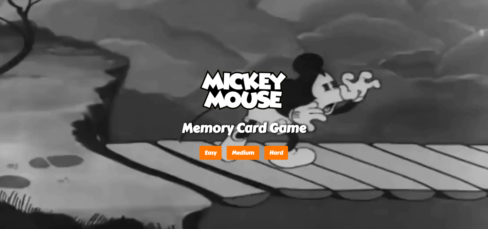
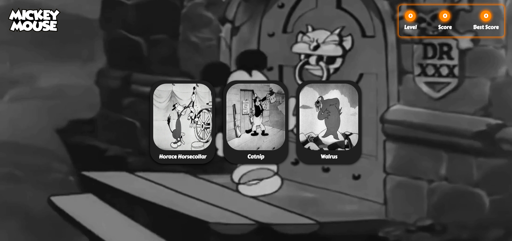
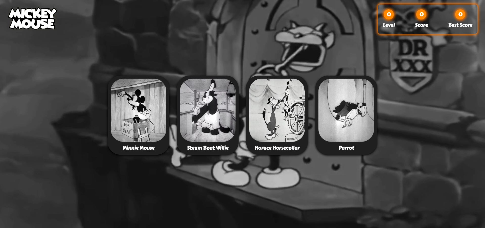
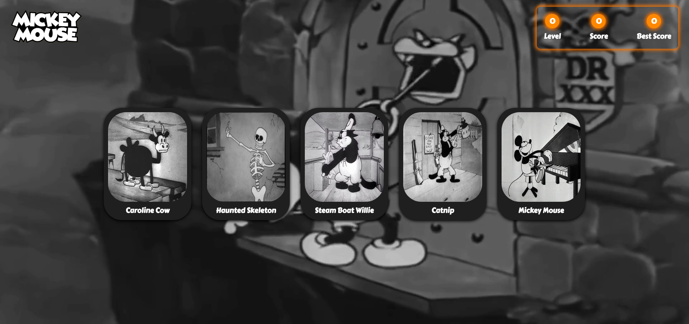
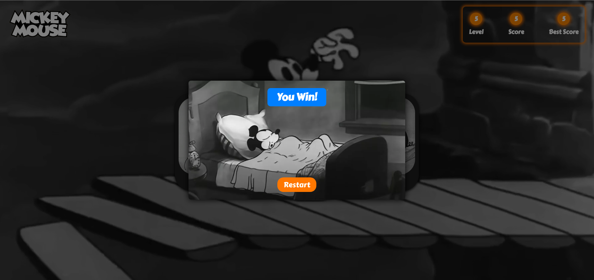
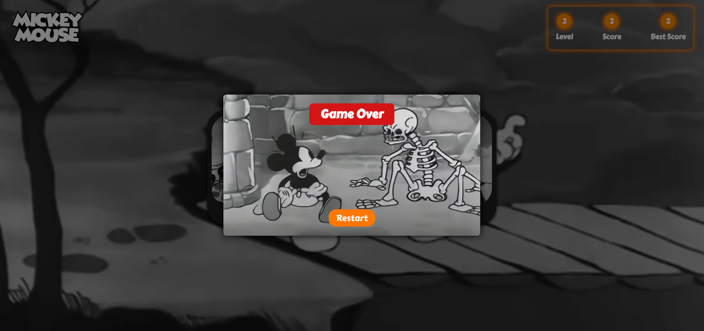

# Memory Card Game

🔗 [View Demo](https://brayden-memory-card-game.netlify.app/)

## Table of Contents
- [About The Project](#about-the-project)
- [Built With](#built-with)
- [Screenshots](#screenshots)
- [Features](#features)

## About The Project
A Micky Mouse Themed Memory Card Game. 

## Screenshots

### Splash Screen

### Easy, Medium & Hard Difficulty

### Winning & Losing Popup

[Back to Top](#memory-card-game)

## Built With

[Back to Top](#memory-card-game)

## Features

- Mickey Mouse Themed
- Three Levels of Difficulty
- Randomly Generated Cards for Each Level/Round
- Counting System for Level, Score & Best Score
- Best Score Shows Highest Score Across All Levels of Difficulty
- Ability to Restart After Win/Loss

[Back to Top](#memory-card-game)
